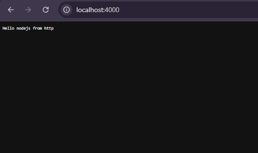

# 📦 Simple Node.js HTTP Server

This is a basic Node.js project that demonstrates how to create a simple HTTP server using the built in `http` module.

---

## 🚀 Features

* Creates a server using Node.js
* Listens on port **4000**
* Responds with a plain text message
* No external dependencies required

---


### 🔍 What’s happening here?

* `http.createServer()` → Creates a web server
* `(req, res)` → Handles incoming requests and sends responses
* `res.writeHead(200, {...})` → Sends HTTP status and headers
* `res.end()` → Ends the response with a message
* `.listen(4000)` → Server runs on port 4000

---

## ▶️ How to Run

1. Make sure you have **Node.js** installed
2. Save the file as `server.js` (or any name)
3. Run the server:

```bash
node server.js
```

4. Open your browser and go to:

```
http://localhost:4000
```

---

⚙️ Setup
1. Install dependencies

Install Nodemon globally (if not already installed):

npm install -g nodemon

2. Enable ES Modules

Add this to your package.json:

{
  "type": "module"
}

3. Add nodemon to your package.json file
  "scripts": {
    "dev": "nodemon server.js"
  },
▶️ Run the Server

open your terminal

npm run dev


## 📌 Output

You should see:

```

```

---

## 🛠️ Notes

* Uses ES Modules (`import`), so ensure your project has:

```json
{
  "type": "module"
}
```

in your `package.json`

---

## 📚 Learning Purpose

This project is great for beginners learning:

* How servers work
* Basic Node.js concepts
* Handling HTTP requests and responses

---

## ✍️ Author

Built by **Amoo Abdulmueez** 🚀

---
